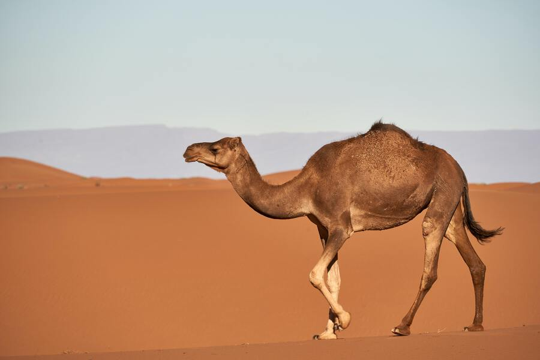

# Camel Passo a Passo

O Camel Passo a Passo é um mini e-book, disponível sob [Creative Commons Attribution 3.0](https://creativecommons.org/licenses/by/3.0/) é fornecer um material inicial para apresentar o Camel e seus projetos para os falantes do Português.

O livro é voltado para usuários que estão começando a trabalhar com integração de sistemas, tem um conhecimento basico sobre Java e se sentem mais confortáveis lendo sobre esse tema em português.

Caso encontre algum erro, tenha algum feedback (positivo ou não), entre em contato com o autor através do [Twitter](https://twitter.com/otavio021) ou via email (angusyoung at gmail.com).